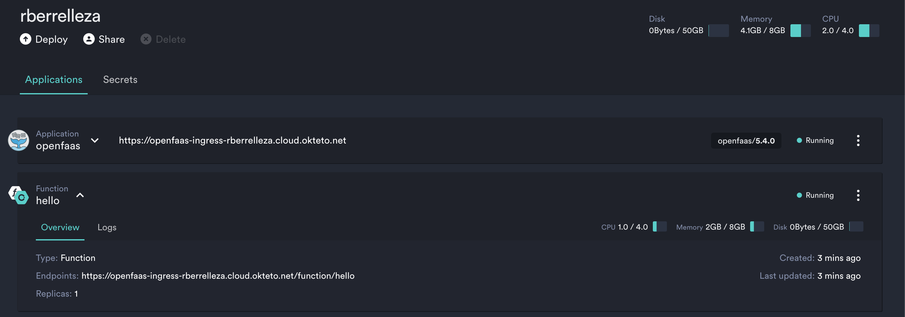

# Develop an NodeJS function with OpenFaaS and Okteto Cloud

## Run your function in Okteto Cloud
1. Deploy `OpenfaaS` from the application catalog.

1. Install the `OpenFaaS` cli locally: 

       curl -sSL https://cli.openfaas.com | sudo sh

1. Log into your OpenFaaS gateway (get the gateway URL from Okteto Cloud) 

        echo $PASSWORD | faas login -g $GATEWAY_URL --password-stdin

1. Update `stack.yaml` so the image name uses your namespace instead of `rberrelleza`

1. [Login to the Okteto Registry](https://okteto.com/docs/cloud/registry#authentication) 

        docker login registry.cloud.okteto.net

1. Build and launch your image
  
        faas-cli up 

1. Verify that everything works fine: 

        faas-cli invoke hello

## Develop your function in Okteto Cloud

1. Go to the `hello` folder and launch your development environment. `okteto.yml` is already configured with everything you need to develop your function: 
        
        cd hello
        okteto up

1. To start your function, just call the `fwatchdog` process in your remote development environment: 
      
        $ fwatchdog

1. Your changes will be automatically synchronized. Just stop and start the watchdog to see them applied.

TODO:
1. Update `okteto.yaml` to use `nodemon` for automatic reload instead of starting and stopping `fwatchdog`